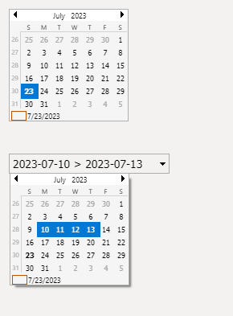
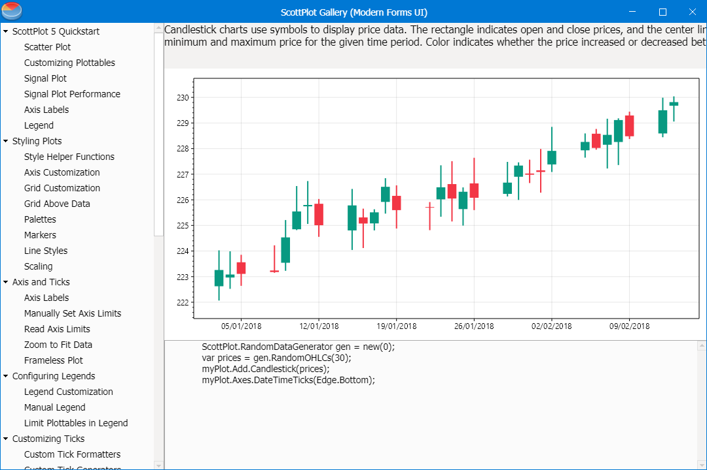
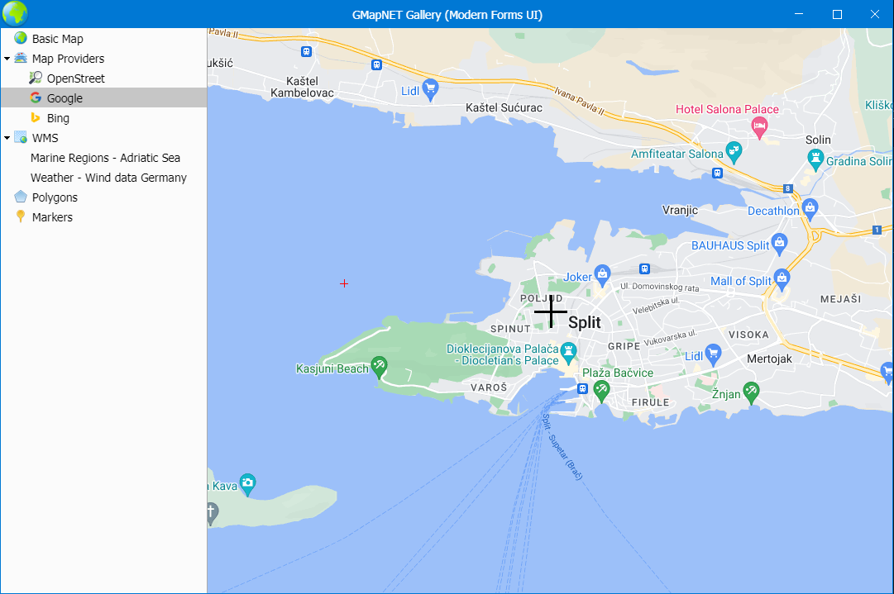

# Modern.Forms.Toolkit

Fork of Modern.Forms project.
The purpose of this fork is to continue updating the original code base with new features and UI components.

### Version 1.4.0
- Added MonthCalendar control.  
(https://www.codeproject.com/Articles/10840/Another-Month-Calendar)  

### Version 1.3.0
- Added ScottPlot 5.x port.  

### Version 1.2.0
- Added GMapNET port.  

### Version 1.1.0
- Added HtmlRenderer port.  
*Modern.Forms port of the https://github.com/ArthurHub/HTML-Renderer project. Fully managed implementation of HTML engine.  
Note, this library doesn't replace WebView/WebBrowser controls, as its capabilities are limited. Many modern HTML features are not supported.*  

### Version 1.0.0
- Modified paint methods and control buffers.  
Single buffer approach is far better alternative in order to achieve good performance on high resolutions.  
This modification will lower both memory and CPU usage for any business application with lot of nested controls.
