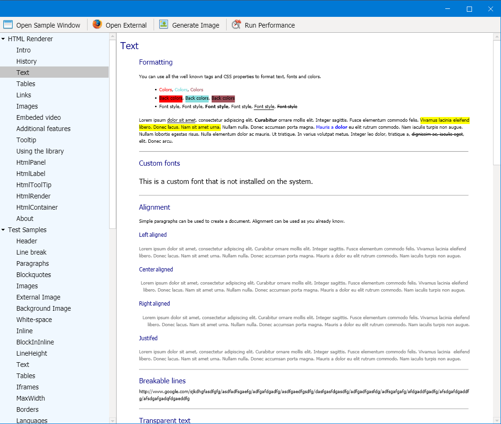

# Modern.Forms.Toolkit

Fork of Modern.Forms project.
The purpose of this fork is to continue updating the original code base with new features and UI components.

# Version 1.1.0
- Added HtmlRenderer port

# Version 1.0.0
- Modified paint methods and control buffers. Single buffer approach is far better alternative in order to achieve good performance on high resolutions. This modification will lower both memory and CPU usage for any more complex application with lot of nested controls.
